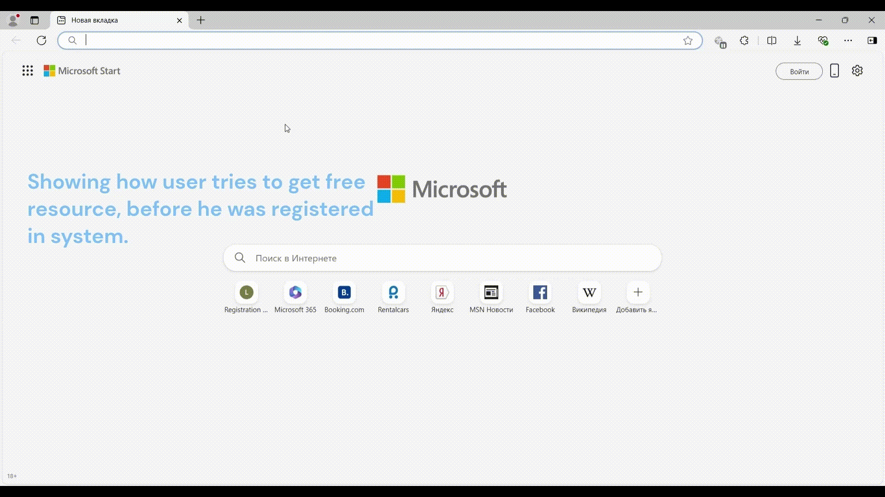
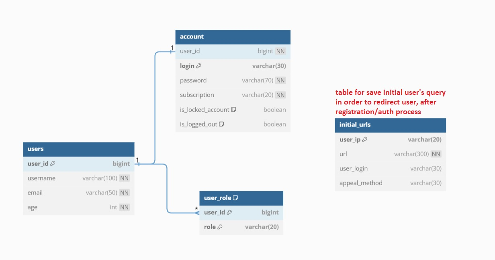

## MyJAAS (backend of a web app)
### Shortcut description
- The simple implementation of a service, which is responsible for user's authentication and authorization process.
- This project is not affiliated with or endorsed by the official JAAS provided by Oracle Corporation, a multinational corporation registered in the United States !!! \

### Special traits
- it uses **jwt token** for authentication process.
- It works using **https** protocol and **CSRF token** what guarantee a base level of security and convenience.
- it can be packed into a **docker container** which allow to deploy the app everywhere, where **Docker Daemon** is installed.
### Schema of BD

### How to launch MyJAAS
1. using **IntelliJ IDEA 2022.1.4 Ultimate** open the project.
2. take consideration with application.yml file.
3. compiling the app by Maven, using command **"mvn clean install"** \
After these steps, it becomes to run up the app and launch postman's tests: \
**a)** import environment's variables: [postman_environments](postman_environments.json) in your **postman desktop app**. \
**b)** import postman's collection tests: [postman_collection](postman_test_collection.json).
4. also it is possible to launch the app out of a docker container: \
**a)** launch **Docker desktop app**. \
**b)** launch terminal and make sure that you are situated in the location with **docker-compose.yml** file, after that
put command **docker-compose up** for compiling and the app starts.
5. TAKE ATTENTION: \
**a)** There is already generated a certificate, which was created 23/11/2023 and validation during 3 650 days.
(recommend using it only for local tests !) \
**b)** In "ru/inner/project/MyJAAS/utils/GenerateNewAndCheckAlreadyExistToken.java" file you maybe want to change **SECRET_KEY**. \
**c)** In my case the app is accessible only within home network, so maybe you should bear it minds before start the app 
and apply extra remedies for security !!!
6. [instruction_of_generating_SSL_TLS_certificate](instruction_of_generating_SSL_TLS_certificate.txt) for maintaining **https** protocol.
### Stack of technology
* Java 17
* Spring Boot 3.0.12
* Spring Security 3.0.12
* Spring Data JPA 3.0.12
* PostgresSQL 42.5.0
* Lombok 1.18.24
* JSON Web Token (JWT) 0.11.5
* Thymeleaf 3.0.15
* OkHttp Client 4.10.0
* Docker 3.8
